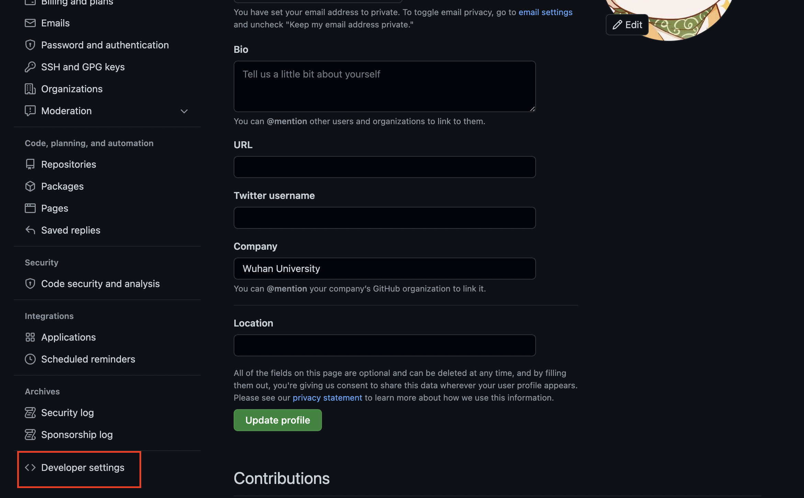
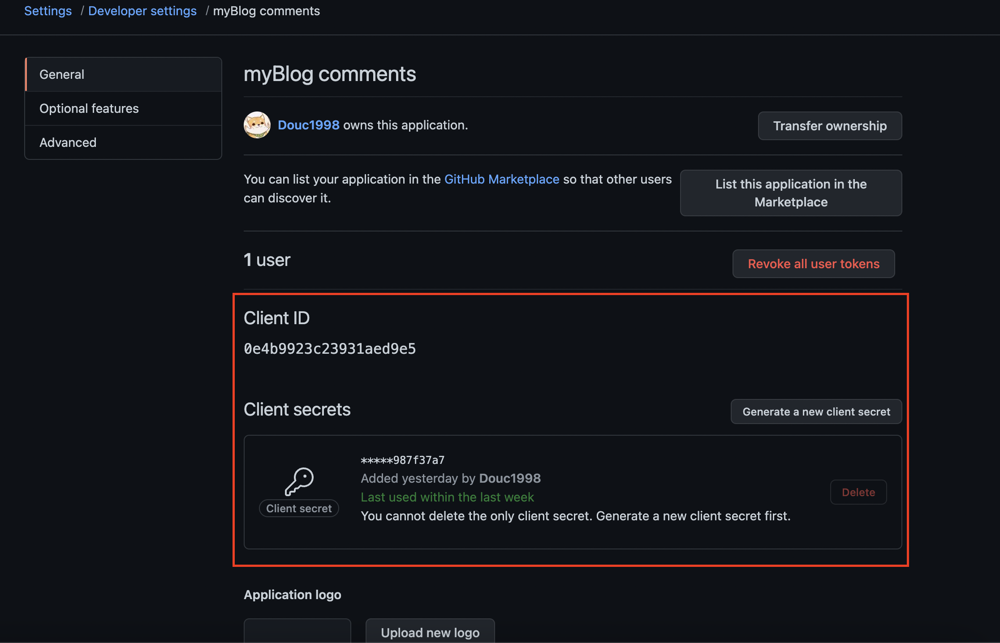
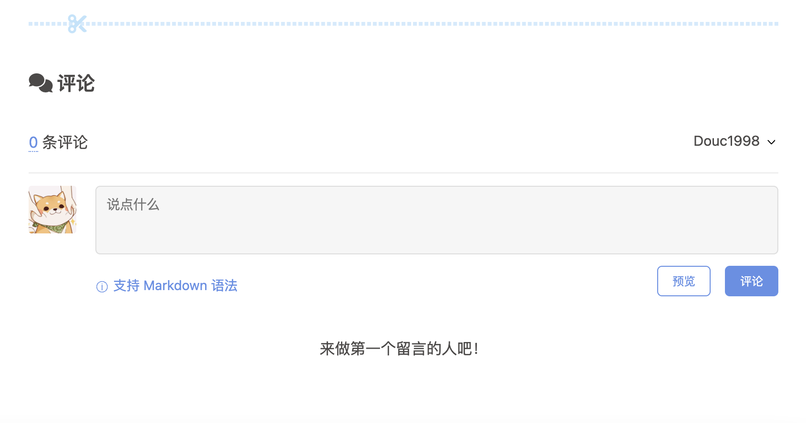
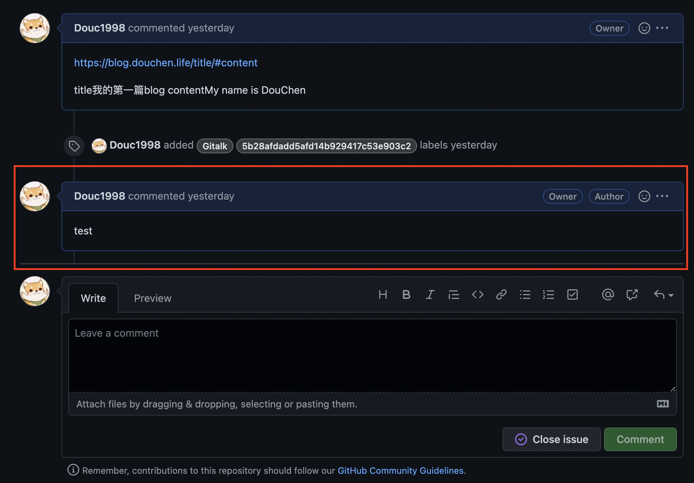

# 前言
虽然已经不怎么玩QQ空间了，但还是会日常刷一刷同学们的动态，偶尔评论一下。诶！说到 **评论**，那我的博客是不是也应该具备这个功能？没错！那必须有！  

其实 **[Butterfly主题](https://Github.com/jerryc127/hexo-theme-butterfly)** 也提供了在线聊天、评论系统等接口，我们只需要选择一个合适的评论平台并进行配置，即可给我们的博客加上评论系统。  

别问我为什么选择 **[Gitalk](https://github.com/gitalk/gitalk)** ，单纯是因为觉得[Github](https://Github.com/)的那只小猫很可爱。

# 环境说明
## Gitalk
**`Gitalk` 是一个基于 `GitHub Issue` 和 `Preact` 开发的评论插件**。`Issue` 大家都很熟悉，就是你仓库下一个用于评论的东西。因此，`Gitalk` 简单来说就是通过 `Issue` 来存储和管理评论的。  
## Hexo 框架
**[Hexo](https://hexo.io/zh-cn/)** 是一款基于[Node.js](https://nodejs.org/en/)的快速、简洁且高效的静态博客框架。Hexo 在之前的[搭建博客教程](https://blog.douchen.life/%E5%8D%9A%E5%AE%A2%E6%90%AD%E5%BB%BA%E6%95%99%E7%A8%8B/)中详细讲过，这里不再赘述。

## Butterfly主题
**[Butterfly](https://Github.com/jerryc127/hexo-theme-butterfly)** 是一款在[hexo-theme-melody](https://Github.com/Molunerfinn/hexo-theme-melody)的基础上进行开发的主题框架。当然，也有很多其他主题，大家可以根据自己的需求进行选择，配置原理也是相似的。

# 搭建流程
搭建`Gitalk`评论系统主要分为两个步骤：
## 创建OAuth Apps请求授权
我们之前说到 `Gitalk` 就是通过 `Issue` 来存储和管理评论的，因此我们需要**创建一个仓库用于存放我们的评论**。  

我们创建博客的时候已经有一个 `username.github.io` 的仓库了，我们也可以就直接用这个仓库的 `Issues` 来存放评论。

下面我们需要在 Github 页面中 **创建 `OAuth Apps` 应用**，具体步骤如下：
1. 点击右上角头像找到 **Settings**。
2. 在 Settings 页面中找到 **Developer settings** 并进入。
3. 进入 **OAuth Apps**, 点击 **New OAuth App** 并进行注册。




在注册时一共有四个字段，分别是`Application name`、`Homepage URL`、 `Application description`、`Authorization callback URL`。各字段说明如下：

字段名称||说明
|:-:|:-:|:-:|
Application name |**必填**| 应用的名字，可以根据自己喜好定义
Homepage URL |**必填**| **主页完整地址**， **`https://` 开头的** ，可以是自己绑定的域名，也可以是 `xxx.github.io` 。
Application description |选填| 应用描述，可写可不写
Authorization callback URL |**必填**| **回调地址，即登录完之后回到哪个地址**，一般和Homepage URL一致，均为主页地址。（注意：必须是 **`https://` 开头的**）

> `Homepage URL` 和 `Authorization callback URL`的填写要严格按照 `https://` 的标准，如果是 `http://` 可能会出错。

下面是我的注册内容：


注册成功后，顺着`Settings` - `Developer settings` - `OAuth Apps` 找到我们刚刚注册的 OAuth Apps。找到 **`ClientID`** 和 **`Client secrets`** ，复制并记录，后续需要在 Butterfly 中进行配置。
> 刚创建可能没有 `Client secrets`，我们可以点击 `Generate a new client secrets` 创建一个即可。



## Butterfly配置Gitalk评论系统
上面配置`OAuth Apps`应用并获得授权的步骤是**固定**的，唯独不同的是**根据不同的主题进行相应的配置**。这里以 `Butterfly主题` 为例，我们需要进入 `Butterfly主题` 的 `yml配置文件` 中进行配置。

首先，找到在 Hexo 文件夹的根目录下找到 `_config.butterfly.yml` 配置文件。（如果对 Hexo 和 Butterfly主题不了解的可以先去查看[这篇博客](https://blog.douchen.life/%E5%8D%9A%E5%AE%A2%E6%90%AD%E5%BB%BA%E6%95%99%E7%A8%8B/)）

在 `_config.butterfly.yml` 配置文件中找到 `comments` 属性， 在 `use` 中选择 `Gitalk`，其他配置根据个人需要选择。
```yaml
# 评论设置
comments:
  # Up to two comments system, the first will be shown as default
  # Choose: Disqus/Disqusjs/Livere/Gitalk/Valine/Waline/Utterances/Facebook Comments/Twikoo
  use: 
    - Gitalk  # (设置gitalk作为评论区)
  text: true # Display the comment name next to the button
  # lazyload: The comment system will be load when comment element enters the browser's viewport.
  # If you set it to true, the comment count will be invalid
  lazyload: true
  count: true # Display comment count in post's top_img
  card_post_count: false # Display comment count in Home Page
```
接着，找到 **`gitalk`** 属性，刚刚复制的 **`ClientID`** 和 **`Client secret`** 填入相应的位置，并输入对应的 **`仓库名称`** 和 **`账号名称`** ，其他参数根据个人需要设置即可。
```yaml
# gitalk
# https://github.com/gitalk/gitalk
# 需要发布 OAuth 应用
gitalk:
  client_id: xxxxx
  client_secret: xxxxx
  repo: your repository name  # 评论会显示在该仓库的issue中
  owner: OAuth owner username  # 创建OAuth的账号
  admin: Repository owner name  # 仓库持有者账号
  language: zh-CN # en, zh-CN, zh-TW, es-ES, fr, ru
  perPage: 10 # Pagination size, with maximum 100.
  distractionFreeMode: false # Facebook-like distraction free mode.
  pagerDirection: last # Comment sorting direction, available values are last and first.
  createIssueManually: true # Gitalk will create a corresponding github issue for your every single page automatically
  option:
```
>小Tips:
> + `repo` 就是**仓库名**。可以是创建博客的io仓库，也可以是其他仓库。
> + `owner` 和 `admin` 不要混淆。`owner` 是**创建 OAuth Application 使用的账号**，`admin` 是**仓库的拥有者的账号**。如果只是个人操作，这两个应该是一样的。

# 部署博客网站
当我们更新完之后，就根据一下指令将新的博客网站部署到 `Github Pages` 上。这里建议每次部署前 `hexo clean` 一下，以免出现错误。
```powershell
hexo clean & hexo g & hexo d
```
**部署后的结果如下图：**


发布的评论会出现在对应仓库的 `Issues` 中。



---
**很感谢你能看到这里！谢谢～**

---
参考资料： (衷心感谢参考资料中各博主的帮助)
+  [Hexo评论系统配置: Gitalk](https://nonlinearthink.github.io/hexo/hexo-gitalk/)
+  [Butterfly官方文档](https://butterfly.js.org/)