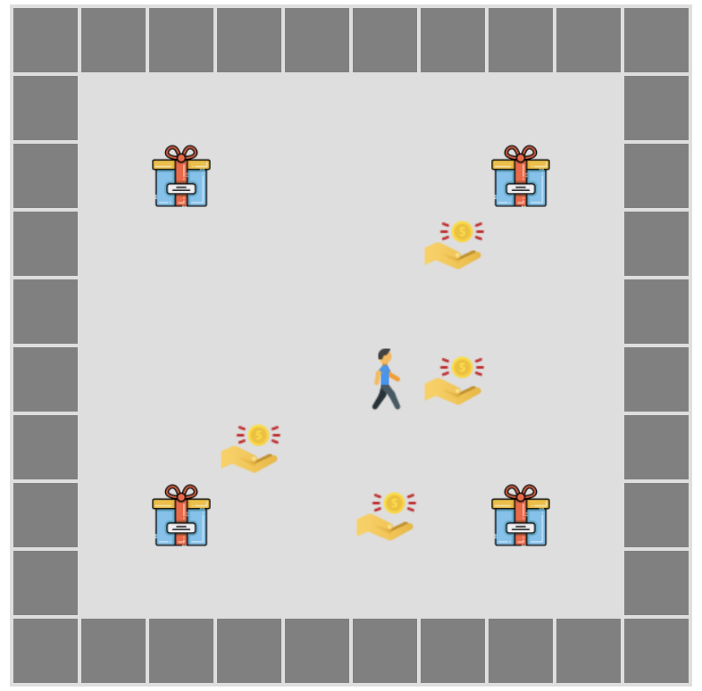
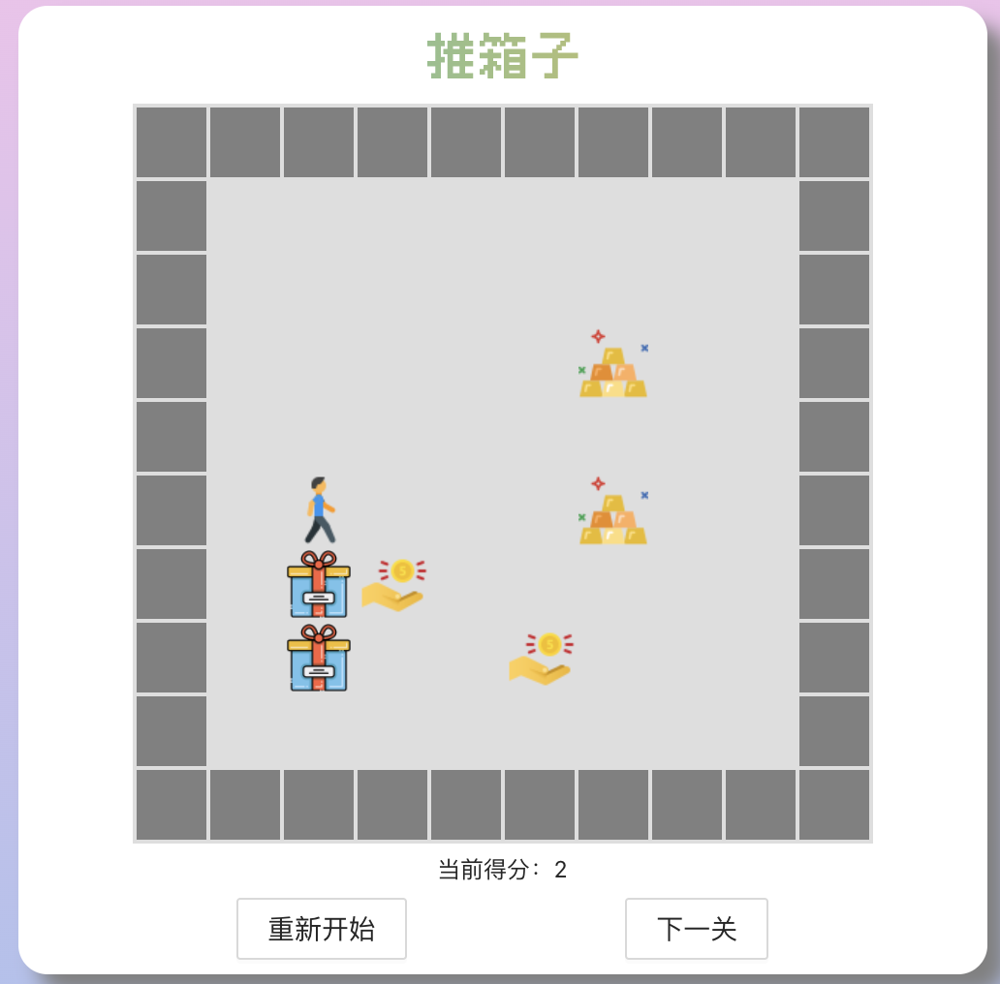

# 前言
在写自己的网页的时候，突然想到写几个怀旧小游戏，比如贪吃蛇（已出教程）、推箱子（该教程）、俄罗斯方块等。上一篇文章已经讲解了[如何实现贪吃蛇小游戏](https://blog.douchen.life/React贪吃蛇小游戏/)，这里我将继续谈一谈如何基于 [React](https://zh-hans.reactjs.org/) 实现**推箱子**小游戏。主要内容依旧是这三项：
> 1. 静态设置
> 2. 游戏算法
> 3. React 渲染

# 静态设置
《推箱子》小游戏的静态设置也是比较简单的，和《贪吃蛇》相同，也主要分为：**方向**，**地图物品**，**Point对象**等。

我们的《推箱子》游戏是基于2D格网形式的，因此我们推动箱子的方向有：上、下、左、右。这四个方向是静态不变的，因此我们可以先写在一个文件里将它们定义好，如下：
```js
// 推箱子小人的移动方向 枚举
export default class Direction {
    /**
     * Direction static params
     * @param {string} UP - 向上移动
     * @param {string} DOWN - 向下移动
     * @param {string} LEFT - 向左移动
     * @param {string} RIGHT - 向右移动
     */
    static UP = 'UP';
    static DOWN = 'DOWN';
    static LEFT = 'LEFT';
    static RIGHT = 'RIGHT';
}
```

此外，我们的游戏中还要给地图设置属性，即地图上对应的物品或状态主要包括：**空地、障碍物、人、箱子、奖励以及当箱子和奖励重叠后的状态**。如下：
```js
// 地图格网属性 枚举
export default class MapGoods {
    /**
     * MapGoods static params
     * @param {string} BLANK - 空
     * @param {string} BARRIER - 墙壁障碍
     * @param {string} PLAYER - 人
     * @param {string} BOX - 箱子
     * @param {string} REWARD - 奖励
     * @param {string} ACHIEVE - 箱子和奖励重叠
    */
    static BLANK = 'BLANK';
    static BARRIER = 'BARRIER';
    static PLAYER = 'PLAYER';
    static BOX = 'BOX';
    static REWARD = 'REWARD';
    static ACHIEVE = 'ACHIEVE';
}
```

我们还需要定静态类，即 `Point` 类。因为我们的地图实际上就是一系列的格网，是由一系列的 `Point` 对象组成，只不过这些对象的地图属性不同，有空地、障碍、人、箱子等等。我们的 `Point` 对象包括两个属性，即**行号**和**列号**。
```js
// 定义Point类, 具有行号r、列号c
export default class Point {
    /**
     * params
     * @param {number} r - 点在二维数组中的行号
     * @param {number} c - 点在二维数组中的列号
     */
    constructor(r = 0, c = 0) {
        this.r = r;
        this.c = c;
    }
}
```

最后，我们还可以定义一个 `MoveObject` 类，它既适用于地图上推箱子的**人**，也适用于地图上的**箱子**。

`MoveObject` 主要包括三个方法，分别是 **获取下一位置`getNextLoc`** 、**是否可以移动`canMove`** 、**向某一方向移动一步`moveStep`** 。代码如下所示：
```js
export default class MoveObject{
    constructor(r = 5, c = 5){
        this.loc = new Point(r, c)
    }
    /**
     * 获取下一位置, 但没有移动
     * @param direction
     * @return {boolean|{x: number, y: number}}
     */
     getNextLoc(direction) {
        // 获取当前位置
        const realLoc = this.loc
        const nextLoc = new Point(realLoc.r, realLoc.c);
        switch (direction) {
            case Direction.UP:
                nextLoc.r -= 1;
                break;
            case Direction.DOWN:
                nextLoc.r += 1;
                break;
            case Direction.LEFT:
                nextLoc.c -= 1;
                break;
            case Direction.RIGHT:
                nextLoc.c += 1;
                break;
        }
        return nextLoc;
    }

    /**
     * 判断是否可以移动
     * @param {string} direction 
     */
    canMove = (direction, world) => {
        const nextLoc = this.getNextLoc(direction);
       if(
           world[nextLoc.r][nextLoc.c] !== MapGoods.BARRIER && 
           world[nextLoc.r][nextLoc.c] !== MapGoods.BOX &&
           world[nextLoc.r][nextLoc.c] !== MapGoods.ACHIEVE){
           return true
       }else{
           return false
       }
    }

    /**
     * 移动一步
     * @param {string} direction 
     */
    moveStep = (direction) => {
        const nextLoc = this.getNextLoc(direction)
        this.loc = nextLoc
    }
}
```

# 游戏算法
《推箱子》的游戏算法在大体上比《[贪吃蛇](https://blog.douchen.life/React贪吃蛇小游戏/)》简单很多，但是需要注意一些小细节。我根据自己做的内容把游戏算法做了一个简单的总结，大致可以分为以下两点：
>**1. 基于键盘监听事件判断人和箱子的移动**
>**2. 箱子状态判断**

## 基于键盘监听事件判断人和箱子的移动
首先，我们的游戏是基于键盘按键实现的，因此需要**绑定键盘监听事件**，这个过程不是算法重点，故不详细讲解。

那么我们如何判断人和箱子的移动呢？主要分为以下几点：
>1. 如果人前面没有箱子，人可以在空地内随便移动。
>2. 如果人前面有箱子，且该箱子在移动方向上如何没有障碍物/其他箱子，人和箱子都可以移动。

因此，我们判断的两种情况的主要基准还是在于：**人前面有没有箱子**。因此，我们构建一个函数用于判断：
```js
/**
 * 判断 player 推动方向是否有箱子
 * @param {String} direction 
 */
existBox = (direction) => {
    const world = this.world;
    const nextLoc = this.player.getNextLoc(direction);
    if(world[nextLoc.r][nextLoc.c] === MapGoods.BOX){
        return true
    }else{
        return false
    }
}
```

### 人前面没有箱子
人前面如果没有箱子的话，也是最简单的一种情形了。只要下一个位置的地图属性不具备阻碍属性，人就可以随意移动。

可能你会看到上面代码里面提到的 `canMove` 中具有“阻碍“作用的地图属性分别有 `BARRIER`、`ACHIEVE` 和 `BOX`。
> 这里我说明一下，`Achieve` 是因为我默认箱子推到奖励位置时就固定住不可继续动了，会变成像墙一样的状态，当然，你们也可以设置可以将箱子继续推出来。`BOX` 具有阻碍作用只**适用于 `MoveObject` 是箱子时，因为我默认人不可以推动两个箱子**。因此，如果一个箱子后面还有一个箱子，那么最后这个箱子会阻碍人推箱子。


### 人前面有箱子
人前面如果有箱子的话，那么问题就稍微复杂，因为箱子是会被人推动的，所以这个时候**箱子和人变成了一个整体，我们需要判断箱子的下一个位置的状态**。

因此，我们判断下一状态的逻辑应该是：
>1. 判断下一格是否有箱子。
>2. 如果有，判断这个箱子在移动方向上的下一格能否移动。
>3. 如果能移动，则判断是否箱子和奖励重叠。（用于计分和判断是否通关）

部分代码如下所示：（不完整，完整的代码可以跳转到我的GitHub[链接](https://github.com/Douc1998/MyWebPage/tree/main/src/project/components/game/components/Sokoban)）
```js
// player在移动方向的下一格存在box
if(this.existBox(direction)){
    // 先获取该方向上的box在boxes中的index（记录箱子编号用于计分和判断通关）
    const index = this.getBox(direction);
    // 判断该box是否可以在该方向上移动, 不可以则不动
    if(boxes[index].canMove(direction, world)){
        // 获取该box下一个位置
        const boxNextLoc = boxes[index].getNextLoc(direction);
        // 如果可以, 判断一下是否 achieve
        if(this.getReward(boxNextLoc)){
            // 如果achieve, 则加入achieve数组
            achieves.push(new Point(boxNextLoc.r, boxNextLoc.c))
            // 删除boxes中的该box
            boxes.splice(index, 1);
        }else{
            // 反之, box移动一格子
            boxes[index].moveStep(direction);
        }
        player.moveStep(direction);
    }
}else{ // 如果不存在, 只需要判断player是否可以移动就行
    if(player.canMove(direction, world)){
        player.moveStep(direction)
    }  
}
```

## 箱子状态判断
如果仔细看了我上面的代码的话，有人会发现我在判断箱子有没有到达奖励时利用了 `index` 记录，这是为了判断：如果箱子和奖励重叠后，将变为 `ACHIEVE` 状态，一方面起到**计分和判断通关**的作用，另一方面是为了触发 **`ACHIEVE` 的阻碍属性**。

我的逻辑是：有两个数组 `boxes` 和 `achieve`，`box` 存放**没有归位的箱子**，`achieve` 存放**归位的箱子**。每当一个箱子归位，`box` 中将删除这个箱子，而`achieve` 将添加该箱子。一旦所有箱子归位，则通关进入下一关！
> 因为《推箱子》游戏的自身特殊性，我们需要自己**预先布置每一关，如果靠计算机随机生成可能会出现箱子在角落上等一系列“不可能通关”情况**。

## React 游戏渲染
我们的游戏地图是 **2D 格网**，因此我们需要排列格网（基于 CSS 的 `float` 布局实现）。

然后基于上述的**地图属性**，绘制不同的颜色，如障碍物墙壁设置为灰色，箱子、人、奖励都可以设置为某个图片，也更形象化一点。效果如下所示：



由于我们的每一个格网是由 `div` 元素实现的，因此我们的思路和《[贪吃蛇](https://blog.douchen.life/React贪吃蛇小游戏/)》游戏是一样的，即每一次移动都会触发以下**渲染流程**：
> 1. 清除上一时刻 `DOM` 节点内容。
> 2. 向 `DOM` 节点中添加新内容。
> 3. 重新渲染。

重点在于**向 DOM 中动态添加元素**，你们也可以使用其他绘制方法，如 `canvas` 画布。代码如下：
```js
// 刷新 重新渲染 => 动态添加div子元素
reRender = () => {
    const divDom = this.game.current;
    divDom.innerHTML = ''; // 清除当前dom节点内容 
    // 重新渲染
    this.state.Map.world.forEach((item, index) => {
        let cols = document.createElement('div');
        cols.className = 'cols';
        cols.key = index;
        item.forEach((itm, idx) => {
            let grid = document.createElement('div');
            grid.className = this.getClass(itm);
            grid.key = index + '-' + idx;
            cols.appendChild(grid)
        })
        divDom.appendChild(cols)
    })
}
```
>当然，在游戏结束后，我们需要通过 `ComponentWillUnmount` 卸载**键盘监听事件**。如果进入下一关，需要在 “进入下一关” 的点击事件 `buttonClick` 中`setState` 设置下一关的游戏地图初始内容**触发 React 重新渲染**（这里我不做过多描述，实现很简单，可以自行尝试）。

# 游戏效果
基于以上一系列操作，进行相应的整合和布置，我们的游戏就可以实现啦！下面将附上游戏的部分截图。如有需要了解详细代码，可以去我的 Github 仓库中查看 👉 [Sokoban](https://github.com/Douc1998/MyWebPage/tree/main/src/project/components/game/components/Sokoban)





---
**很感谢你能看到这里！欢迎交流分享！谢谢～**

🌟 下期游戏预告：《俄罗斯方块》
（不过博主最近科研不太顺利 + 被导师push，暂时没什么时间写，我会尽快的！等我满血回归！）
