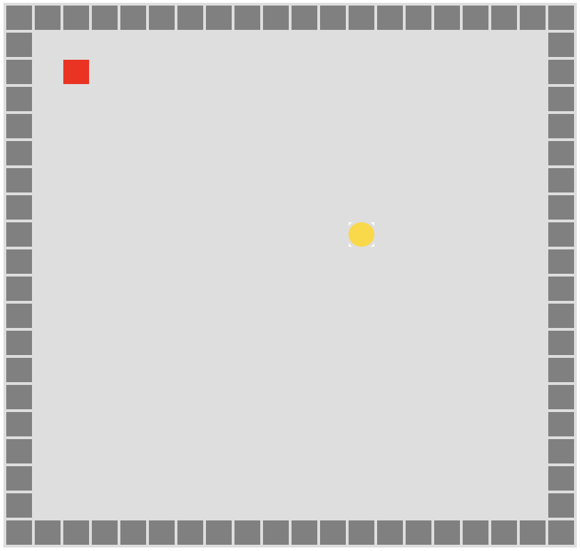
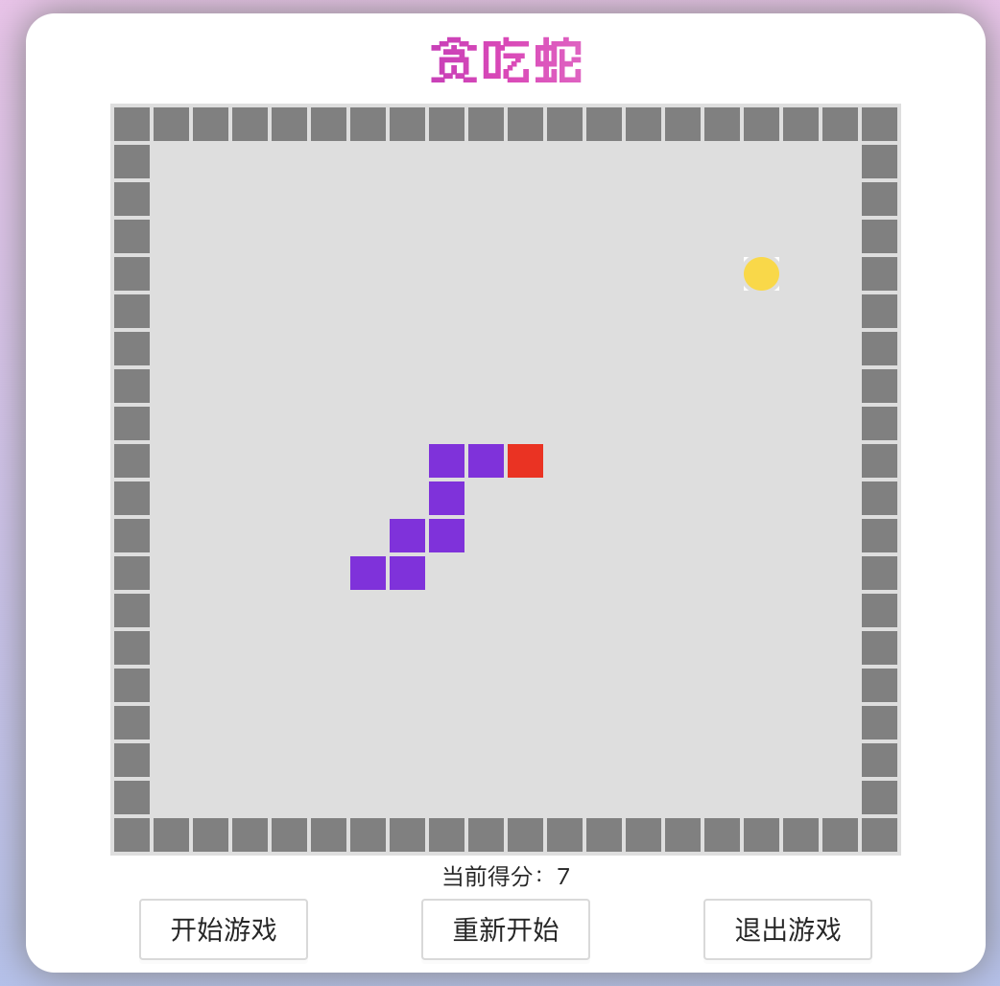
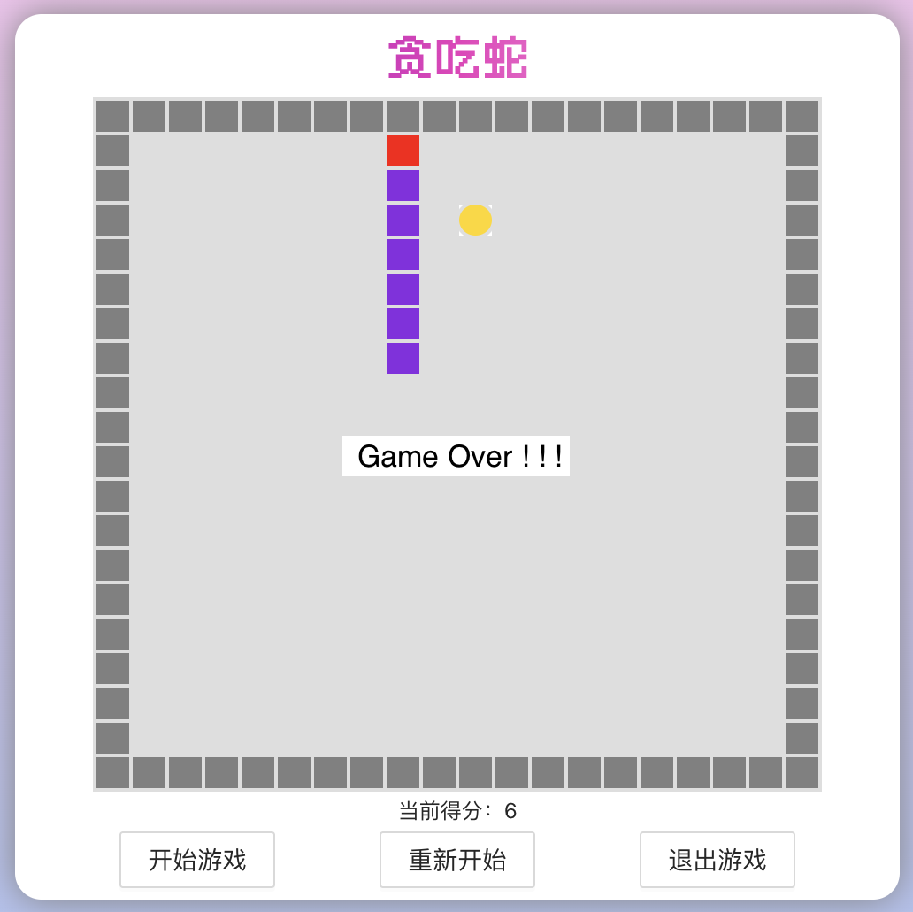

# 前言
在写自己的网页的时候，突然想到写几个怀旧小游戏，比如贪吃蛇（该教程）、推箱子（[已出教程](https://blog.douchen.life/React推箱子小游戏/)）、俄罗斯方块等。因此，这里我将简单谈一谈如何基于 [React](https://zh-hans.reactjs.org/) 实现**贪吃蛇**小游戏。主要内容包括：
> 1. 静态设置
> 2. 游戏算法
> 3. React 渲染

# 静态设置
受限于我的语文功底，用“静态设置”来描述可能不太准确。简单来说就是，我们**需要定义哪些静态状态？哪些对象？**。很简单，我们可以联想到：**方向**，**地图物品**，**Point对象**等。

我们的贪吃蛇游戏是2D的，因此我们蛇可以移动的方向只有：上、下、左、右。这四个方向是静态不变的，因此我们可以先写在一个文件里将它们定义好，如下：
```js
// 贪吃蛇移动的方向 枚举
export default class Direction {
    /**
     * Direction static params
     * @param {string} UP - 向上移动
     * @param {string} DOWN - 向下移动
     * @param {string} LEFT - 向左移动
     * @param {string} RIGHT - 向右移动
     */
    static UP = 'UP';
    static DOWN = 'DOWN';
    static LEFT = 'LEFT';
    static RIGHT = 'RIGHT';
}
```

此外，贪吃蛇游戏中的物品主要包括：空地、障碍物、蛇（你可以分为蛇头和蛇身，这样有利于之后绘制）、食物。如下：

```js
// 地图格网属性 枚举
export default class MapGoods {
    /**
     * MapGoods static params
     * @param {string} BLANK - 空
     * @param {string} BARRIER - 障碍
     * @param {string} SNAKE_HEAD - 蛇头
     * @param {string} SNAKE_BODY - 蛇身体
     * @param {string} FOOD - 食物
    */
    static BLANK = 'BLANK';
    static BARRIER = 'BARRIER';
    static SNAKE_HEAD = 'SNAKE_HEAD';
    static SNAKE_BODY = 'SNAKE_BODY';
    static FOOD = 'FOOD';
}
```

最后，我们还需要定静态类，即 `Point` 类。因为我们的地图实际上就是一系列的格网，是由一系列的 `Point` 对象组成，只不过这些对象的地图属性不同，有空地、障碍、蛇等等。我们的 `Point` 对象包括两个属性，即**行号**和**列号**。

```js
// 定义Point类, 具有行号r、列号c
export default class Point {
    /**
     * params
     * @param {number} r - 点在二维数组中的行号
     * @param {number} c - 点在二维数组中的列号
     */
    constructor(r = 0, c = 0) {
        this.r = r;
        this.c = c;
    }
}
```

# 游戏算法
贪吃蛇的算法还是比较简单的，主要可以分为以下几点：
>**1. 基于键盘监听事件判断蛇的移动**
>**2. 食物（奖励）的生成**
>**3. 蛇的长度变化**
>**4. 蛇的状态判断**


## 基于键盘监听事件判断蛇的移动
我们用电脑操作贪吃蛇的移动，因此需要给网页添加上键盘监听事件，**通过监听到键盘的响应，判断出蛇下一步该如何移动**。然而，这里也有几个注意点，如：

**1. 按键方向和当前方向是否矛盾**

考虑这一点的原因是，在蛇的长度不为1时，我们的蛇是不能随意“掉头”的。举个例子，当我们的蛇向右边移动时，如果我们按下左键，这个时候**正确的做法应该是无响应**，继续保持蛇向同一个方向运动。代码如下：
```js
/**
 * 判断是否可以转向 => 主要考虑 “掉头就走” 的情况
 * @param oldDirection
 * @param newDirection
 * @return {Boolean}
 */
canChangeDirection = (oldDirection, newDirection) => {
    switch (oldDirection) {
        case Direction.UP:
            return !(newDirection === Direction.DOWN);
        case Direction.DOWN:
            return !(newDirection === Direction.UP);
        case Direction.LEFT:
            return !(newDirection === Direction.RIGHT);
        case Direction.RIGHT:
            return !(newDirection === Direction.LEFT);
        default:
            return false;
    }
}
```

**2. 按键方向和当前方向是否相同**
这个步骤主要看游戏设计者希不希望增加游戏难度。简单来说，如果按键的方向和当前移动方向是相同的话，应该是**无响应**的，蛇继续按照相同速度并保持该方向移动。但如果你希望增加一点游戏难度的话，你可以设计为：**如果方向相同，则蛇“快进”一下**。因此，这一步主要看你怎么设计咯（不是重点）。

## 食物（奖励）的生成
贪吃蛇游戏操控蛇的目标就是为了**吃到食物**！因此，我们需要在地图中布置食物。这里我就通过一个最简单的方法来生成食物：**随机生成**。随机生成的思路就是：
> 1. 利用随机数找到地图上的某一个位置。
> 2. 判断该位置是不是 “空地” 属性，如果是则生成，如果不是则重复步骤1。
逻辑很简单，实际上就是一个**不断生成随机数，不断判断，直到符合条件**的过程。部分代码如下：
```js
/**
 * 在地图中随机生成一个食物坐标，不会在墙壁或者snake的位置生成
 * @return {Point}
 */
addFoodToWorld = () => {
    let foodPoint;
    // 只要生成的随机点正在被world或者snake使用，就重新生成
    do {
        foodPoint = this.getRandomPoint();
    } while (!this.isPointBlank(foodPoint));

    return foodPoint;
}

/**
 * 在地图中随机生成一个点
 * @return {Point}
 */
getRandomPoint = () => {
    const r = Math.round(Math.random() * (this.rows - 1));
    const c = Math.round(Math.random() * (this.cols - 1));
    return new Point(r, c);
}

/**
 * 判断一个点有没有被使用
 * @param point
 * @return {boolean}
 */
isPointBlank = (point) => {
    return this.world[point.r][point.c] === MapGoods.BLANK;
}
```

## 蛇的长度变化
蛇的长度变化这一问题主要出现在**蛇吃到食物**的条件下。如果蛇没有吃到东西，则长度并不会变化。**一旦我们的蛇下一时刻吃到了食物，那么我们的蛇的长度将 + 1**。因此，我们这里需要实现的就是：**蛇头和蛇身体位置的变换**，这个问题也可以转化为**数组的顺序移动**。部分代码如下：
```js
/**
 * 像某个方向移动一下蛇。
 * @param direction {Direction}
 * @param eatFood {boolean} 是否吃到了食物
 */
moveStep(direction, eatFood) {
    const head = this.head;
    const body = this.body;
    const neck = this.body[0];
    // 记录蛇身的尾巴, 用于后续插入到body数组中
    const oldTail = body.length === 0 ? head : _.cloneDeep(body[body.length - 1]);

    // 首先将蛇身倒序依次向前移动
    for (let i = body.length - 1; i > 0; i--) {
        body[i].r = body[i - 1].r;
        body[i].c = body[i - 1].c;
    }
    // 如果蛇长度不为1, 即有body => 脖子位置移动到蛇头
    if (neck != null) {
        neck.r = head.r;
        neck.c = head.c;
    }

    // 如果吃到了东西，新增长度就是原来尾巴的位置
    if (eatFood) {
        body.push(oldTail);
    }
    
    // 蛇头根据方向移动
    this.head = this.getNextHead(direction)
}

/**
 * 获取下一步 蛇头 运动的位置
 * @param direction
 * @return {boolean|{x: number, y: number}}
 */
getNextHead(direction) {
    const realHead = this.head;
    const nextHead = new Point(realHead.r, realHead.c);

    switch (direction) {
        case Direction.UP:
            nextHead.r -= 1;
            break;
        case Direction.DOWN:
            nextHead.r += 1;
            break;
        case Direction.LEFT:
            nextHead.c -= 1;
            break;
        case Direction.RIGHT:
            nextHead.c += 1;
            break;
    }
    return nextHead;
}
```
## 蛇的状态判断
蛇的状态判断也就是**判断蛇是否死亡**，主要就是判断两种可能性：

> 1. 蛇头是否撞到障碍物。
> 2. 蛇头是否撞到蛇的身体。

这里我们需要先获取到蛇的下一个移动位置，再进行判断。部分代码如下：
```js
/**
 * 判断蛇是不是死了
 * @param isHead {direction} 移动后的蛇头位置，因为每次移动，都是蛇头在最前面，所以只判断蛇头位置就可以
 */
isDead = (direction) => {
    const { head, body } = this.snake; // 获取当前蛇的位置
    const nextHead = this.snake.getNextHead(direction); // 获取蛇头的下一位置(当时还没移动)
    // 先判断有没有咬到自己
    for(let i = 0; i < body.length; i++){
        if(nextHead.r === body[i].r && nextHead.c === body[i].c){
            return true
        }
    }
    // 判断有没有撞墙
    return this.world[nextHead.r][nextHead.c] === MapGoods.BARRIER;
}
```

# React 渲染
上面我们已经描述了小游戏必备的**静态配置**和**算法原理**，下面我们就需要基于 `React` 来实现组件绘制和逻辑应用。主要包括以下几部分：
> 1. 游戏初始化配置
> 2. 游戏渲染
> 3. 游戏结束设置

## 游戏初始化配置
游戏初始化需要很多准备工作，如：
> 1. 键盘监听事件
> 2. 定时器事件
> 3. 地图初始化

**1. 键盘监听事件**
我们需要给整个游戏页面添加**键盘监听事件**，并将按键的 `keycode` 和移动方法 `Direction` 进行一一映射。代码如下：
```js
/**
 * 键盘的键码 w(119) a(97) s(115) d(100) 转换成方向的操作
 * @param event
 * @return {string}
 */
keyCodeToDirection = (event) => {
    const e = event || window.event; // 捕获事件
    const k = e.keyCode || e.which; // 获取键码
    switch (k) {
        case 97:
            return Direction.LEFT;
        case 119:
            return Direction.UP;
        case 100:
            return Direction.RIGHT;
        case 115:
            return Direction.DOWN;
        case 32:
            return 'Stop';
        default:
            return Direction.INVALID;
    }
}
```

**2. 定时器事件**
当游戏开始时，我们希望实现的是：**蛇是保持运动的** 👉 如果没按键，蛇会按照一定速度自动向原来方向运动，直到改变方向蛇会向该一方向自动运动。

因此，我们需要给整个游戏页面添加**定时器事件** 👉 **以一定的间隔速度，不断重新渲染游戏页面**，以实现蛇自动运动。代码如下：
```js
/**
 * 定时器, 游戏开始之后 蛇会自动跑
 */
myTimer = () => {
    // setInterval会在一定间隔内不断执行其中的function
    this.timer = setInterval(() => {
        const { moveDirection, start } = this.state;
        if (start) {
            this.move(moveDirection);
        }
    }, this.state.speedInterval);
};
```

**3. 地图初始化**
我们的游戏地图是 **2D 格网**，因此我们需要排列格网（基于 CSS 的 `float` 布局实现）。

然后基于上述的**地图属性**，绘制不同的颜色，如障碍物设置为灰色，蛇头设置为红色，食物设置为黄色等。效果如下所示：



## 游戏渲染
刚刚我们提到，我们会在定时器事件中设定一定的时间间隔，按照这个时间重复渲染游戏页面，以实现动态效果。

由于我们的每一个格网是由 `div` 元素实现的，因此我们的思路就是：
> 1. 清除上一时刻 `DOM` 节点内容。
> 2. 向 `DOM` 节点中添加新内容。
> 3. 重新渲染。

重点在于**向 DOM 中动态添加元素**，你们也可以使用其他绘制方法，如 `canvas` 画布。代码如下：
```js
// 刷新 重新渲染 => 动态添加div子元素
reRender = () => {
    const divDom = this.game.current;
    divDom.innerHTML = ''; // 清除当前dom节点内容 
    // 重新渲染
    this.state.Map.world.forEach((item, index) => {
        let cols = document.createElement('div');
        cols.className = 'cols';
        cols.key = index;
        item.forEach((itm, idx) => {
            let grid = document.createElement('div');
            grid.className = this.getClass(itm);
            grid.key = index + '-' + idx;
            cols.appendChild(grid)
        })
        divDom.appendChild(cols)
    })
}
```
至于如何渲染，渲染哪些新内容，这个还需要基于一些其他状态条件的变化进行配置，如：地图食物刷新、蛇变长、速度加快等。

## 游戏结束设置
既然有游戏初始化配置，那么也应当有游戏结束设置。当我们判断蛇的状态为死亡或者玩家需要重新开始游戏时，我们需要结束游戏 👉 **卸载组件**。
> 1. 键盘监听事件
> 2. 定时器事件

对 `React` 有一定了解的开发者应该都知道，卸载组件的功能需要定义在 `componentWillUnmount()` 函数中。因此，代码如下：

```js
/**
 * 组件清除时 清除 定时器 和 监听函数
 */
componentWillUnmount() {
    clearInterval(this.timer);
    window.removeEventListener('keydown', this.keyDown)
}
```

# 游戏效果
基于以上一系列操作，进行相应的整合和布置，我们的游戏就可以实现啦！下面将附上游戏的部分截图。如有需要了解详细代码，可以去我的 Github 仓库中查看 👉 [GreedySnake](https://github.com/Douc1998/MyWebPage/tree/main/src/project/components/game/components/GreedySnake)





---
**很感谢你能看到这里！谢谢～**