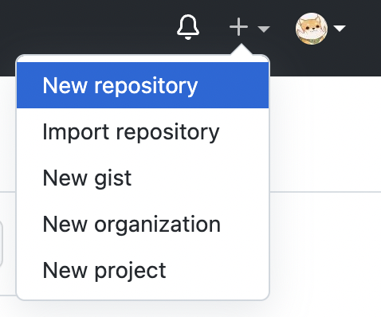
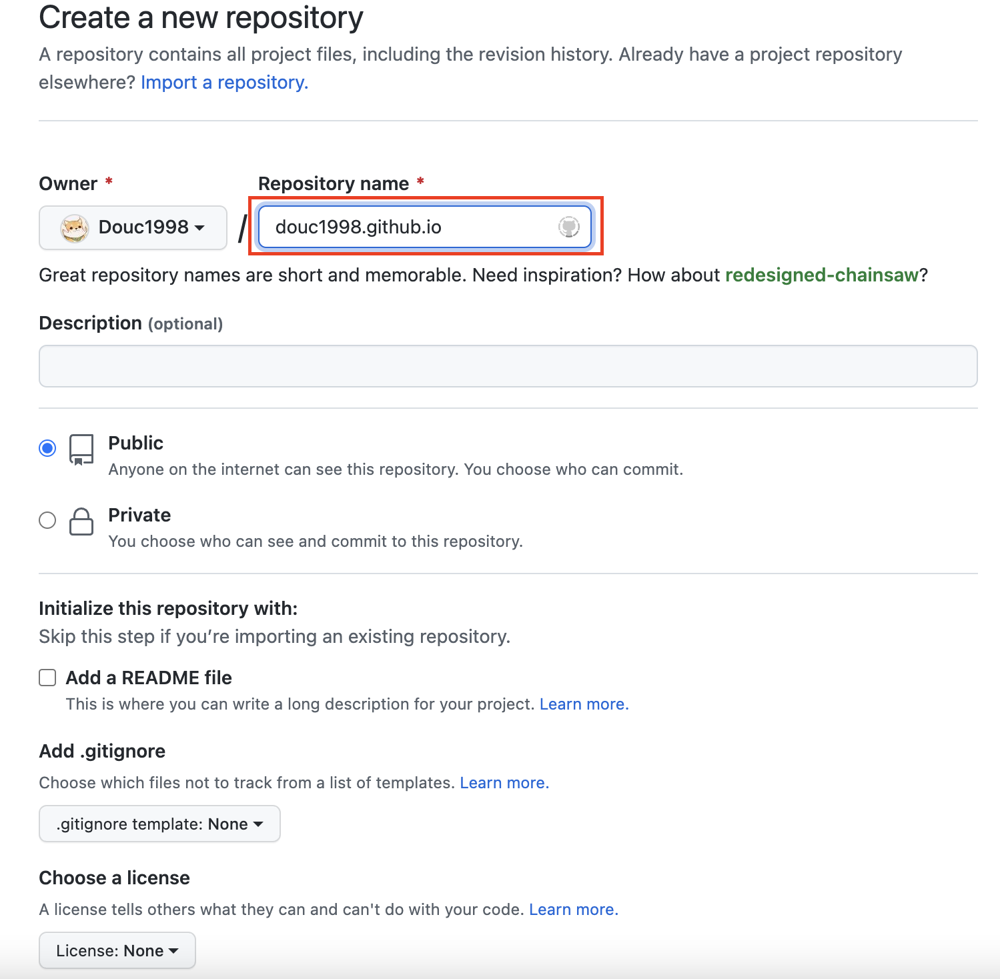
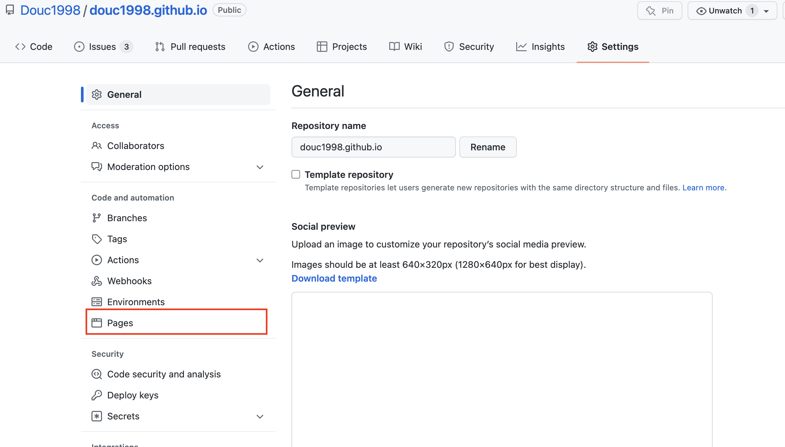
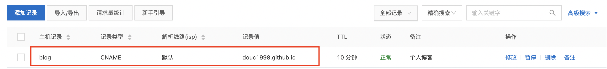
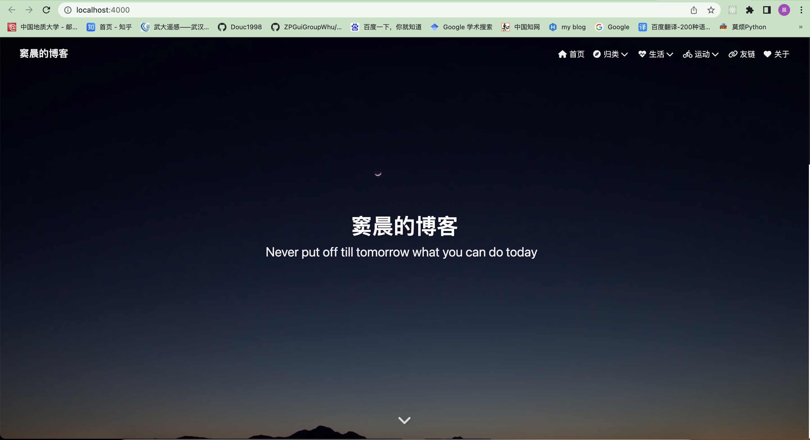

# 前言
提起**博客**二字，似乎有一种年代感，还记得小时候玩过[人人网](http://www.renren.com/)、[百度贴吧](https://tieba.baidu.com/index.html)、[QQ空间](https://qzone.qq.com/)等社交平台。然而，随着时代的推进，这些类似于**个人博客**的社交平台逐渐开始走向没落。各种实时互动的社交软件层出不穷，受益于此，咱们也可以很方便地联系好友，传送讯息。  

在这个嘈杂喧闹的世界中，或许有那么一群人会希望拥有一个属于自己的小空间。在那儿，可以记录自己的学习、心情以及生活中的各种趣事，可以无忧无虑地做自己。很幸运的是，通过一些已有的专业知识和网络上他人共享的资料，我搭建了属于自己的博客。  

（🤚唠叨结束，进入正题）**你是否也想拥有属于自己的博客？如果心动了，就继续往下看吧！我会把整个搭建博客的流程和遇到的问题及其解决方案分享给大家。**  

# 环境说明
整个过程所有配置均为**免费**，下面我将介绍构建博客中所使用到的平台和插件。  
## Github Pages
**[Github](https://Github.com/)** 是一个面向开源及私有软件项目的托管平台。它不仅能够让我们托管代码和各种资料，也提供了`Github Pages`的功能，允许我们**利用Github的服务器部署自定义网页**。  
## Hexo
**[Hexo](https://hexo.io/zh-cn/)** 是一款基于[Node.js](https://nodejs.org/en/)的快速、简洁且高效的静态博客框架。它能够解析`Markdown`文件并生成静态网页，帮我们省去了构建、布局网页等繁琐过程。  
## Butterfly主题
**[Butterfly](https://Github.com/jerryc127/hexo-theme-butterfly)** 是一款在[hexo-theme-melody](https://Github.com/Molunerfinn/hexo-theme-melody)的基础上进行开发的主题框架。简单来说，`Butterfly`主题能够帮我们美化我们的博客，使其更生动更满足我的需求。Of Course，也有很多其他主题，大家可以根据自己的需求进行选择，我在此不一一赘述。  

# 搭建流程
介绍完我们搭建博客的环境配置后，我们需要进行一系列的准备，以便于我们后续搭建博客。  

> **1. 注册Github 账号**  
**2. 安装Node.js**  
**3. 安装Hexo**  
**4. 配置Butterfly主题**  

# 开始搭建我们的博客
下面开始我们的搭建博客之旅～  
## 注册Github账号并创建io仓库
假设大家都有一个 **[Github](https://Github.com/)账号**，如果没有请点击链接自行注册。接着我们需要在Github页面上创建仓库。  

登陆账号进入Github页面之后，在右上角的头像旁边有一个 **“+”** 号，我们点击 **New repository** 即可。  



然后我们进入创建仓库页面，并填写仓库的相关信息。**注意：红色方框中填写的仓库名的形式有要求！必须是`username.Github.io`。** username是你的用户名，如果像我一样有大写的话，写成大小写都可以，因为之后Github都会给你转成小写。  



> 之后我们就可以在自己的仓库中找到刚刚创建的说明网页，**Github也会通过 `username.Github.io` 地址提供对网页的访问**。  

我们找到刚刚创建的仓库，点击 **Settings**，在左侧列表中找到 **Pages**，就可以看到我们的仓库信息了。  



**到这里我们的Github Pages就已经全部完成了！**   

如果想给我们的网页**更换访问链接**，可以继续往下看；反之直接跳过这一部分。  

> 我们可以自己注册域名指向我们这个说明网页，就不需要总是使用`https：//username.Github.io`来访问我们的博客了。下面我以[阿里云](https://cn.aliyun.com/)为例。  
>
> 1. 购买了一个属于自己的域名，比如我的是 `douchen.life`。   
> 2. 接着，在自己的域名下DNS解析一个`CNAME`指向你的 `username.Github.io`（简单来说就是解析域名和IP的对应关系）。  
> 3. 然后将自己的域名地址输入到下面的 **Custom domain**。Github会自动帮你注册https证书。  
> 
> 
>
> 

## 安装Node.js
**`Node.js`是我们运行Hexo插件的基础**，这里不详细赘述[Node.js](https://nodejs.org/en/)的安装和配置过程。读者可以进入官网查阅官方文档或者自行[百度](https://www.baidu.com/)，下面提供下载链接和教程链接，希望对你有用。  

1. [下载安装Node.js](http://nodejs.cn/)  
2. [安装Node.js教程](https://Github.com/nswbmw/N-blog/blob/master/book/1.1%20Node.js%20%E7%9A%84%E5%AE%89%E8%A3%85%E4%B8%8E%E4%BD%BF%E7%94%A8.md)  

## 安装Hexo
**`Hexo`** 的相关资料如下：  
> 1. Github: http://Github.com/hexojs/hexo
> 2. [官方文档](https://hexo.io/zh-cn/docs/index.html)（多学习参考文档有利于提高我们阅读技术文档的能力）

下面将介绍**如何安装和部署Hexo**。  

1.首先，**创建一个空文件夹或者把之前的`username.Github.io`空仓库`clone`下来**，用于存放Hexo。  

2.然后，进入该文件夹，打开终端，利用Node.js的包管理器 **`npm`安装Hexo**:  

+ 执行 **`npm install hexo-cli -g`** 命令安装依赖项  

> 注意：使用Mac OS时，进行 -g 全局安装会报错提示权限不足。我们需要在npm命令前添加 `sudo` 以管理员身份执行, 即 **`sudo npm install hexo-cli -g`** ，之后输入密码即可。  
。 
+ 执行 **`hexo init`** 初始化该文件夹。  
+ 执行 **`npm i`** 安装需要的组件。  
+ 执行 **`hexo g`** 生成博客网页的静态文件。  
+ 执行 **`hexo s`** 开启本地的 Hexo 服务器，接着我们在浏览器地址栏中输入[http://localhost:4000/](http://localhost:4000/)即可打开我们的博客界面！  

>我的博客由于已经换过主题并且修改过内容了，所以你们的初始博客会是 Hexo 主题的样子  



当我们已经可以在本地生成博客网页之后，我们还需要将本地的项目推送到Github Pages上，下面将介绍Mac OS下如何实现，共分为4个步骤。**如果已经在本地配置好了 `SSH Keys` 则可以跳过 1 和  2**。  

**1. 在本地设置Github的个人信息**

我们可以在终端中输入以下命令：
```powershell
# xxx就是你的Github用户名，比如我的是Douc1998
git config --global user.name "xxx" 
# xxx@xxx.com就是你创建Github时用的邮箱  
git config --global user.email "xxx@xxx.com" 
```
**2. 生成SSH Keys**

首先我们在终端中输入 `ls -al ~/.ssh` 判断一下之前有没有生成过 `ssh keys`。  

如果返回的结果中有 `id_rsa.pub` 文件的话，利用指令 `cat ~/.ssh/id_rsa.pub` 打开该文件，并复制内容，进入步骤3。  

如果没有则需要我们生成。如下：  
+ 在终端中输入指令 `ssh-keygen -t rsa -C "xxx@xxx.com"`
+ 过程中会要求你输入存储的文件夹名、密码和确认密码，可以直接一路三个回车过去
+ 创建成功后，输入指令 `open ~/.ssh`
+ 找到 `id_rsa.pub` 并打开，复制内容

**3. Github授权SSH key**

当我们已经得到了 `id_rsa.pub` 文件的内容后，我们需要在Github中进行授权。  

首先打开 **Settings**，找到 **SSH and GPG keys**，新建一个SSH keys，并把复制的内容粘贴到**Key**中，Title随意定义即可。  


**4. 推送本地项目**

我们打开之前初始化好了的 Hexo 文件夹，其内部大体结构是这样的：
（此处参考了 **SYZ师兄** 的博客，他对这部分的讲解更为详细 👉 [Windows 环境下 Hexo+Github 搭建个人博客教程](https://sunyunzeng.com/)）
```
|-- node_modules
|-- scaffolds
|-- source
   |-- _posts
|-- themes
|-- _config.landscape.yml
|-- _config.yml
|-- .gitignore
|-- package.json
```
>- node_modules 是该项目依赖的各种包，当我们使用 `npm install`时，Node.js会根据 package.json中的依赖项安装所需的包。  
>
>- scaffolds：本意是 “脚手架” 的意思，这里引申为模板文件夹。当你 hexo new <layout(布局)> <'title'> 的时候，Hexo 会根据该文件夹下的对应文件进行初始化构建。  
>
>- source：source 文件夹将存储用户的文件资源，你的博客md文件将会存放在_posts文件夹下，其目录下的md文件，会被编译成 html 文件，放到 public 文件夹下。  
>
>- themes：主题文件夹，用于存放博客主题。  
>
>- _config.yml：博客网站的全局配置文件，包括多种描述信息，你的自定义样式修改几乎都在这里。 
> 
>- _config.landscape.yml：Hexo的landscape初始主题配置文件。
>
>- .gitignore：.gitignore 文件作用是声明不被 git 记录的文件。  
>
>- package.json：框架的基本参数信息和它所依赖的插件，在 npm 安装时使用 --save 保存进去。  

首先，我们需要修改 `_config.yml` 文件，直接跳转到文件末尾，找到`deploy`参数，设置为如下形式并保存：  
```YAML
deploy:
  type: git
  repository: https://github.com/Douc1998/douc1998.github.io.git  # (你的仓库地址)
  branch: master # (你的分支)
```
然后，我们需要安装依赖库：`npm install hexo-deployer-git --save`  

接着，我们在 Hexo文件夹下打开终端，执行 `hexo new post "postname"`命令即可创建我们的第一篇博客。  

>我们能够在`source/_posts`文件夹里找到 `postname.md` 文件，这就是我们的博客文件，书写是基于 Markdown 语法的，这里不多赘述，提供一篇语法教程 👉 [Markdown基本语法](https://www.jianshu.com/p/191d1e21f7ed)  

最后，编辑好博客内容后，我们需要将网站部署到 Github Pages上，依次执行以下命令： `hexo g` 👉 `hexo d` 实现部署。

**到此为止，你的第一篇博客就成功上传到自己的主页了！**
> 提示：hexo d 之后就不需要 git add / commit / push 等一系列操作了。当然，你也可以在 Github 上新建分支，如Hexo，专门用于push文件下的其他文件。  

## 配置Butterfly主题

上面创建的博客主题是基于 Hexo 初始主题。如果你想使用一些其他主题，也可以自行配置，我将以 **Butterfly 主题**为例，简要介绍如何配置。  
+ [Butterfly Github](https://github.com/jerryc127/hexo-theme-butterfly)
+ [Butterfly官方文档](https://butterfly.js.org/)  

根据[Butterfly官方文档](https://butterfly.js.org/)可知，我们可以直接使用 git 指令进行下载：
```powershell
git clone -b master https://github.com/jerryc127/hexo-theme-butterfly.git themes/butterfly
```
>执行命令的位置在 **Hexo 文件夹的根目录下**。当然，我们也可以把下载的butterfly 文件夹复制到 Hexo/themes 路径下。  

接着，我们还需要安装 hexo 的 pug 和 stylus 渲染器，终端执行命令：  
```powershell
npm install hexo-renderer-pug hexo-renderer-stylus --save
```
最后，我们就是需要在 `Hexo/_config.yml` 文件中找到 `theme` 属性，设置为 `butterfly` 即可。  
```yaml
theme: butterfly
```
我们分别执行 `hexo clean` 👉 `hexo g` 👉 `hexo s` 即可看到我们的 butterfly 主题的博客啦！确认无误即可 `hexo d` 部署到我们的 Github Pages上啦！  

>**小Tips**: 建议把 `themes/butterfly/_config.yml` 复制一份到 Hexo 文件夹根目录下，更名为 `_config.butterfly.yml`，以后只需要修改这个yml文件即可。（这种方法可以有效避免 butterfly 主题升级带来的不便）

---
**很感谢你能看到这里！谢谢～**

---
参考资料： (衷心感谢参考资料中各博主的帮助)
+  [Hexo 官方文档](https://hexo.io/zh-cn/docs/index.html)  
+  [Windows 环境下 Hexo+Github 搭建个人博客教程](https://sunyunzeng.com/%E5%8D%9A%E5%AE%A2%E6%90%AD%E5%BB%BA%E6%95%99%E7%A8%8B/)  
+  [Hexo 实战](https://zhuanlan.zhihu.com/p/161436475)
+  [Butterfly官方文档](https://butterfly.js.org/)


