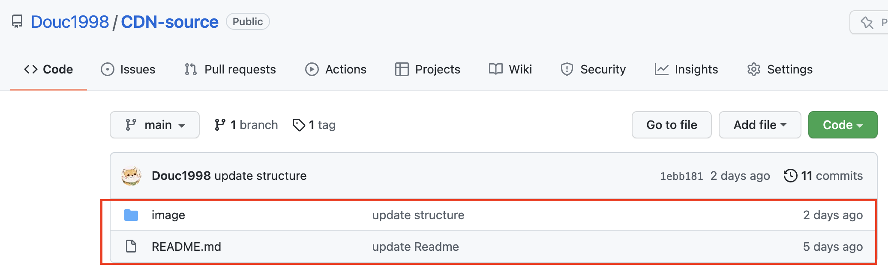

# 前言
之前在搭建博客的时候有想到要写这么一个教程，但是因为种种原因给搁置了。今天，我的好朋友突然跟我说：“你博客里的图片加载挺快的呀！” 我就想起来了这么件事，因此打算做一个简单的教程，也方便自己以后查看。

首先，或许大家看了我的[搭建博客教程](https://blog.douchen.life/%E5%8D%9A%E5%AE%A2%E6%90%AD%E5%BB%BA%E6%95%99%E7%A8%8B/)或者网上的一些其他教程，已经成功搭建了属于自己的博客！

但是，因为我们的博客托管在免费的 [Github](https://github.com/) 平台上，所以访问和加载速度其实和服务器相比还是有点儿“感人”的。这时候，如果你**把博客里要用的一些图片或者资源都放在了本地并直接上传到博客对应的仓库中，则会影响到你博客的加载速度**。随着博客资源的增加，影响则会越发明显。

因此，我们可以通过 `创建图床` 的方式，来大大加速你的博客访问速度和图片资源加载速度。图床就是`存储图片的服务器`，即 **将你的图片上传到一个服务器上，然后通过特定的链接去访问**，十分好理解。

话不多说，下面我们就开始 `基于 jsDeliver + Github 搭建免费图床` ！

# 环境说明
+ **`jsDelivr`**
+ **`Github`**

这里就不详细说明 Github 是什么以及如何创建仓库，大家应该都很清楚了。不清楚的可以自行[百度](https://baidu.com)或者查看我[其他关于Github的教程](https://blog.douchen.life/%E5%8D%9A%E5%AE%A2%E6%90%AD%E5%BB%BA%E6%95%99%E7%A8%8B/)。 
## jsDelivr
[jsDelivr](https://www.jsdelivr.com/)是一款免费、开源的**加速CDN**公共服务。`CDN`(Content Delivery Network)，即**内容分发网络**。它是构建在现有网络基础之上的智能虚拟网络，依靠部署在各地的边缘服务器，通过中心平台的负载均衡、内容分发、调度等功能模块，使用户就近获取所需内容，降低网络拥塞，提高用户访问响应速度和命中率。

**简而言之，就是它可以让我们访问资源的速度大大提高！**

# 开始配置
整个过程十分简单，主要分为两大步骤：
+ **创建 Github 仓库用于存储图片和其他资源数据**。
+ **通过 jsDelivr CDN引用资源**。

## 创建 Github 仓库用于存放资源
首先，我们需要创建一个 Github 仓库用于存储图片和资源数据。如取名为 `CDN-source`。


接着我们可以向仓库中添加我们博客中需要加载的资源，如图片数据或其他资源。



找到 **`Release`** ，点击 `Draft a new release`，进入发布资源页面。

>PS: **发不发布都可以，只是发布不同版本的资源有利于资源管理！也可以 不发布 ，跳过下面内容直接进入下一章节。至于为什么我后面会讲**。


接着我们需要填写`Release`的相关信息，如下：


>注意：发布的版本号可以自定义，但是需要记住，因为后面在填写访问地址时需要用到！

## 通过 jsDelivr CDN引用资源
这里所说的 **通过 jsDelivr CDN引用资源** 看起来好像很复杂的样子，实际上很简单。简单到什么地步呢？**只需要在访问地址中添加 jsDelivr 的信息即可**。如下：

只需要把我们的访问资源的链接改为如下即可:
```
https://gcore.jsdelivr.net/gh/你的用户名/你的仓库名@发布的版本号/文件夹名/文件名

# gh 表示是 Github 仓库
```
这里的发布版本号就是我们刚刚创建的版本号。以我的仓库为例，那么我们的访问链接可以改为：
```
https://gcore.jsdelivr.net/gh/Douc1998/CDN-source@1.0/image/logo/myLogo.png

# 上面版本号改为了1.0, 因为我之前发布的是1.0版本。
# 所以如果你按照我上面教程写的2.0，只需要把仓库后面的版本号改为2.0即可。
```

**如何按照我上面说的，不发布该怎么办呢？**

很简单，**发布版本只是有利于我们区分新旧数据**，便于资源管理等等。如果我们数据量本来就很小，以及需要频繁更新的话，那我们每次更新完都要发布那就会显得很麻烦。

因此，我们可以直接 **不发布**，访问的地址去掉 `@发布的版本号` 即可！
```
https://gcore.jsdelivr.net/gh/你的用户名/你的仓库名/文件夹名/文件名
```

这样链接访问的就是你的资源仓库里的最新内容，不会再去考虑发布的版本了。

那么写到这里可能就有人会说，那整个搭建图床的过程很简单咯，只需要在地址栏中添加 `jsDelivr` 的信息就行咯？

没错！所以简单来说，整个搭建图床的过程如下：
1. **通过 Github 创建资源仓库**。
2. **上传资源到仓库中**。
3. **(发布版本 / 不发布)** 。
4. **添加 `gcore.jsdelivr.net` 信息**。

网络上也有不少博主在我们的基础上使用 [PicGo](https://github.com/Molunerfinn/PicGo) 来实现的。这种方法可以让图片管理更加方便，有需要可以自行查阅相关资料。

---
**很感谢你能看到这里！谢谢～**


