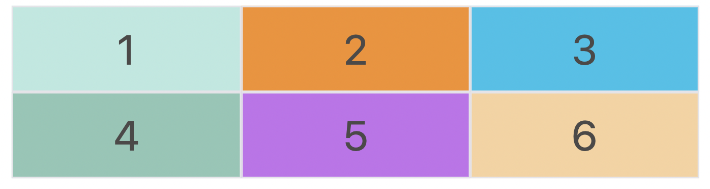
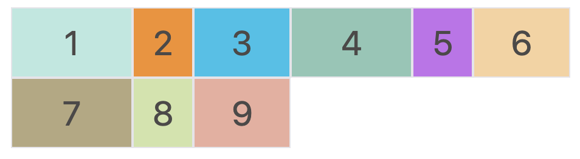
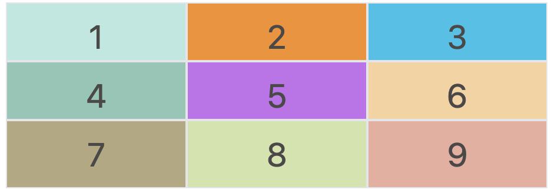
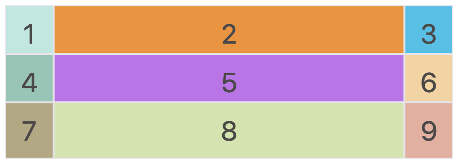
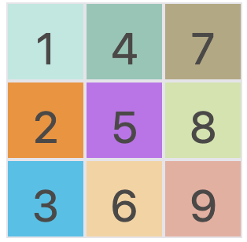

# 前言

我在自己的仓库中已经简单聊过 `Flex` 布局，如有需要可以自取[查看](https://github.com/Douc1998/CSS-Notes/issues/5)。由于这篇笔记只是简单地讲了讲**参数**和**对应的设置**，并没有系统地进行讲解，因此后续我也将会出一期**关于 `Flex` 布局**的教程，谈一谈自己的学习感悟和理解。

题归正传，本篇文章讲谈一谈另一种布局，即 **`Grid`网格布局**。`Grid` 布局与 `Flex` 布局有一定的相似性，都可以指定容器内部多个项目的位置。然而，它们也存在一些区别并适用于特定的应用场景。

`Flex` 布局是**一维布局**，我们只能在一条线上或者说一个维度上，排布我们的子元素，而 `Grid` 布局则是将容器划分成 "**行**" 和 "**列**" ，类似于矩阵、格网，是**二维布局**。举个例子，如下：


# 概述
`Grid` 布局顾名思义，就是**网格**。提到网格，在我们生活中的应用场景就很多了，比如：**菜单**、**用户属性表**或一系列**复杂的二维排布**的内容。如果使用其他的布局，虽然也可以实现我们的需求，但是其过程可谓是十分复杂且繁琐的，并且可能存在 “**适应性/灵活性不强**” 的问题。然而，`Grid` 布局为我们提供了便捷，并且几乎可以用于所有的浏览器。

网格是由一系列单元格和分割线组成的，而单元格内容的定位，我们可以根据 “先行后列/先列后行”等**顺序**、**网格线编号**或**行列号**实现。

下面我将详细介绍 `Grid` 布局的**相关属性**及其对应**参数**。

# 基本属性
## 容器属性
`Grid` 布局的属性可分为**容器属性**和**项目属性**，前者确定格网整体一系列的设置，后者确定格网内部项目的设置。

### display 属性
与其他布局类似，我们可以通过 `display: grid` 来指定容器采用网格布局。
```css
.mycontainter {
    display: grid;
    /* 其他属性 */
}
```
网格布局的容器将会是块级元素，但如果我们想要设置为行内元素，可以设置为 `display: inline-grid`。

> 注意，设为网格布局以后，容器子元素的 `float`、`display: inline-block`、`display: table-cell`、`vertical-align`和`column-*`等属性都将失效。


### grid-template-columns / rows 属性
当我们通过 `display: grid` 设定布局后，我们就需要对其内部的单元格进行**大小设置**。`grid-template-columns` 可以设置**列方向**（横向）上的长度，`grid-template-rows` 可以设置**行方向**（纵向）上的长度。我们设定的长度可以是**固定值**、**百分比**、**关键字**等等。下面以 2 x 3的网格 为例。

#### 固定值
给行和列的宽度设定为**固定不变的值**。
```css
.mycontainter {
    display: grid;
    /* 以 2 x 3 的格网为例 */
    grid-template-columns: 50px 100px 50px;
    grid-template-rows: 50px 50px;
    /* 其他属性 */
}
```


#### 百分比
给行和列的宽度设定为**容器百分比的大小**，可以根据不同屏幕大小显示不同大小。
```css
.mycontainter {
    display: grid;
    /* 关键代码 */
    grid-template-columns: 33.3% 33.3% 33.3%;
    grid-template-rows: 50% 50%;
    /* 其他属性 */
}
```


#### repeat() 函数
`repeat` 关键字即**重复**的意思。有时候，重复写同样的值非常麻烦，尤其网格很多时。这时，可以使用 `repeat()` 函数，简化重复的值。上面的代码用 `repeat()` 改写如下。

```css
.mycontainer {
  display: grid;
  /* 关键代码 */
  grid-template-columns: repeat(3, 33.33%);
  grid-template-rows: repeat(3, 33.33%);
  /* 其他属性 */
}
```
`repeat()` 函数有两个参数，分别是：**重复次数**，**长度值**。

repeat()重复某种模式也是可以的。
```css
grid-template-columns: repeat(2, 100px 20px 80px);
```

上面代码定义了6列，第一列和第四列的宽度为 100px，第二列和第五列为 20px，第三列和第六列为 80px。



#### auto-fill 关键字
有时候我们已知**容器的长度**，但没有设置子元素长度，并希望子元素能够尽可能的填充容器。那么我们就可以通过**结合 `repeat()` 和 `auto-fill`** 关键字来实现。
```css
.mycontainter {
    display: grid;
    /* 关键代码 */
    grid-template-columns: repeat(auto-fill, 50px);
    grid-template-rows: 50px 50px 50px;
    /* 其他属性 */
}
```


#### fr 关键字

为了方便表示比例关系，网格布局提供了 `fr` 关键字（fraction 的缩写，意为"片段"）。**如果两列的宽度分别为1fr 和 2fr，就表示后者是前者的两倍**。

```css
.mycontainter {
    display: grid;
    /* 关键代码 */
    grid-template-columns: 1fr 2fr 3fr;
    grid-template-rows: 50px 50px 50px;
    /* 其他属性 */
}
```


#### minmax() 函数
我们也可以设置一个范围，即长度不小于某个值，不大于某个值。`minmax()` 函数产生一个长度范围，表示长度就在这个范围之中。它接受两个参数，分别为**最小值**和**最大值**。

```css
.mycontainter {
    display: grid;
    /* 关键代码 */
    grid-template-columns: 1fr 1fr minmax(100px, 1fr);
    grid-template-rows: 50px 50px 50px;
    /* 其他属性 */
}
```




#### auto 关键字
当我们一列有三个网格，我们设定好左右两个网格长度后，希望中间的网格自适应调整大小，那我们可以使用 `auto` 关键字实现，

```css
.mycontainter {
    display: grid;
    /* 关键代码 */
    grid-template-columns: 50px auto 50px;
    grid-template-rows: 50px 50px 50px;
    /* 其他属性 */
}
```



### grid-row-gap / grid-column-gap 属性
如果没有设定 `gap` 属性值，网格中的单元格都是紧凑排布，中间是没有间隙的。但在很多应用场景中，我们希望单元格间具有一定的间隙。因此，可以通过 `grid-row-gap` \ `grid-column-gap` \ `grid-gap` 属性实现。 `grid-gap` 是前两者合并简写形式，语法如下:
```css
.mycontainter {
    display: grid;
    grid-template-columns: 50px 50px 50px;
    grid-template-rows: 50px 50px 50px;
    /* 关键代码 */
    grid-gap: 10px 20px
    /* 其他属性 */
}
```


### grid-auto-flow 属性
当我们不通过其他排布方式来排列单元格时，容器的子元素会按照顺序，自动放置在每一个网格。**默认的放置顺序是"先行后列"，即先填满第一行，再开始放入第二行**。

我们可以通过设置 `grid-auto-flow: column` 来让子元素 “**先列后行**”。
```css
.mycontainter {
    display: grid;
    grid-template-columns: 50px 50px 50px;
    grid-template-rows: 50px 50px 50px;
    /* 关键代码 */
    grid-auto-flow: column;
    /* 其他属性 */
}
```


### grid-template-areas 属性
有“先行后列”排序，也有“先列后行”排序，当然我们也可以通过设定区域，在后续让每个子项目决定自己属于哪个/哪些区域。
```css
.mycontainer {
  display: grid;
  grid-template-columns: 50px 50px 50px;
  grid-template-rows: 50px 50px 50px;
  grid-template-areas: 'a b c'
                       'd e f'
                       'g h i';
}
```
上面代码就是将一个 3 x 3 的网格内部的单元格标记为 `a-i` 区域，可用于后续项目属性。

划分也可以设定为：第一行是 a 区域，第二行是 b 区域，第三行是 c 区域。如下
```css
grid-template-areas: 'a a a'
                     'b b b'
                     'c c c';
```

### justify-items / align-items / place-items 属性

如果我们需要设置**单元格内容（内部子元素）的对齐方式**，我们可以通过 `justify-items`、`align-items`、 `place-items` 属性来设置。

`justify-items` 属性设置单元格内容的**水平位置**（左中右），`align-items` 属性设置单元格内容的**垂直位置**（上中下）。`place-items` 属性则是前两者的合并简写形式。

```css
.mycontainer {
    /* 关键代码 */
    justify-items: start | end | center | stretch;
    align-items: start | end | center | stretch;
}
```
这两个属性的写法完全相同，都可以取下面这些值:

> 1. ***start***：对齐单元格的起始边缘。
> 2. ***end***：对齐单元格的结束边缘。
> 3. ***center***：单元格内部居中。
> 4. ***stretch***：拉伸，占满单元格的整个宽度（默认值）。

### justify-content / align-items / place-items 属性

如果我们需要设置**网格容器内部元素的对齐方式**，我们可以通过 `justify-content`、`align-content`、 `place-content` 属性来设置。

`justify-content` 属性是整个内容区域在容器里面的水平位置（左中右），`align-content`属性是整个内容区域的垂直位置（上中下）。

```css
.mycontainer {
  justify-content: start | end | center | stretch | space-around | space-between | space-evenly;
  align-content: start | end | center | stretch | space-around | space-between | space-evenly;  
}
```
这两个属性的写法完全相同，都可以取下面这些值：(以下内容引用阮一峰老师的[教程](http://www.ruanyifeng.com/blog/2019/03/grid-layout-tutorial.html?ivk_sa=1024609v))

> 1. ***start***: 对齐容器的起始边框。

> 2. ***end***: 对齐容器的结束边框。

> 3. ***center***: 容器内部居中。

> 4. ***stretch***: 项目大小没有指定时，拉伸占据整个网格容器。

> 5. ***space-around***: 每个项目两侧的间隔相等。所以，项目之间的间隔比项目与容器边框的间隔大一倍。

> 6. ***space-between***: 项目与项目的间隔相等，项目与容器边框之间没有间隔。

> 7. ***space-evenly***: 项目与项目的间隔相等，项目与容器边框之间也是同样长度的间隔。


## 项目属性

上面说的都是如何从**格网容器**这个宏观角度来调整样式，下面我们讲细谈一下**项目属性**，即格网容器内部每个 `item` 的属性设置。

### grid-column-start / grid-column-end / grid-row-start / grid-row-end 属性

如果我们并不想按照 “先行后列” 或 “先列后行” 的顺序排布项目，而希望自由度更高一些，那我们就可以利用 `grid-column-start`、`grid-column-end`、`grid-row-start`、`grid-row-end` 属性按照**网格线**进行定位。比如：

```css
.item-1 {
    grid-column-start: 1;
    grid-column-end: 3;
    grid-row-start: 1;
    grid-row-end: 3;
}
```

上面的 demo 就是定义：**column 方向 第一条网格线开始到第三条网格线结束，row 方向 第一条网格线开始到第三条网格线结束**的区域。如下图所示：


> 此外，我们除了用**网格线的编号**定位，还可以用**网格线的名称**，或 **`span`关键字表示跨越**来实现，这里不详细讲解，有需要可以自行搜索资料学习。

### grid-column / grid-row 属性
上面的四个属性可以合并简写为两个属性，分别是 `grid-column` 和 `grid-row`。参数格式为：
```css
.item-1 {
    grid-column: <start-line> / <end-line>;
    grid-row: <start-line> / <end-line>;
}
```

### grid-area 属性
在容器属性中，我们提及到了 `grid-template-areas` 属性用于将网格**分区**。在项目属性中，我们可以利用 `grid-area` 属性**根据区域编号对项目进行定位**。
```css
.mycontainer {
  display: grid;
  grid-template-columns: 50px 50px 50px;
  grid-template-rows: 50px 50px 50px;
  grid-template-areas: 'a b c'
                       'd e f'
                       'g h i';
}
.item-1 {
    grid-area: b;
}
```
在上面的 demo 中，我们先将容器分成 `a-i` 九个区域，然后将 `1` 定位到了 `b` 的位置。效果如下图：


### justify-self / align-self / place-self 属性

在容器属性中，我们提到如果需要设置**单元格内容（内部子元素）的对齐方式**，可以通过 `justify-items`、`align-items`、 `place-items` 属性来设置。

当然，我们也可以在项目属性中，针对每一个 item 设置各自的对齐方式，通过 `justify-self`、`align-self`、`place-self` (合并简写形式）属性实现。
```css
.item-1 {
  justify-self: start | end | center | stretch;
  align-self: start | end | center | stretch;
}
```
这两个属性都可以取下面四个值,

> 1. ***start***：对齐单元格的起始边缘。
> 2. ***end***：对齐单元格的结束边缘。
> 3. ***center***：单元格内部居中。
> 4. ***stretch***：拉伸，占满单元格的整个宽度（默认值）。


# 测试 Demo 代码(需要自取)

```css
<style>
.container {
    max-width: 500px;
    margin: 0 auto;
}
.grid {
    display: grid;
    margin: 20px;
    grid-template-columns: 50px 50px 50px;
    grid-template-rows: 50px 50px 50px;
    grid-template-areas: 'a b c'
                         'd e f'
                         'g h i';
}

.item {
  font-size: 2em;
  text-align: center;
  border: 1px solid #e5e4e9;
}

.item-1 {
    background-color: #b8e8e0;
    grid-area: b;
}

.item-2 {
  background-color: #f68f26;
}

.item-3 {
  background-color: #12c2e9;
}

.item-4 {
  background-color: #8CC7B5;
}

.item-5 {
  background-color: #c471ed;
}

.item-6 {
  background-color: #f8d29d;
}

.item-7 {
  background-color: #b5a87f;
}

.item-8 {
  background-color: #d0e4a9;
}

.item-9 {
  background-color: #ECAD9E;
}
</style>

<div class='container'>
 <div class="grid">
    <div class="item item-1">1</div>
    <div class="item item-2">2</div>
    <div class="item item-3">3</div>
    <div class="item item-4">4</div>
    <div class="item item-5">5</div>
    <div class="item item-6">6</div>
    <div class="item item-7">7</div>
    <div class="item item-8">8</div>
    <div class="item item-9">9</div>
</div>
</div>
```

---
**很感谢你能看到这里！谢谢～**

---
参考资料： (衷心感谢各参考资料提供的帮助)
+  [CSS Grid 网格布局教程](http://www.ruanyifeng.com/blog/2019/03/grid-layout-tutorial.html?ivk_sa=1024609v)
+  [grid布局](https://blog.csdn.net/yyy_wj/article/details/113175202)
